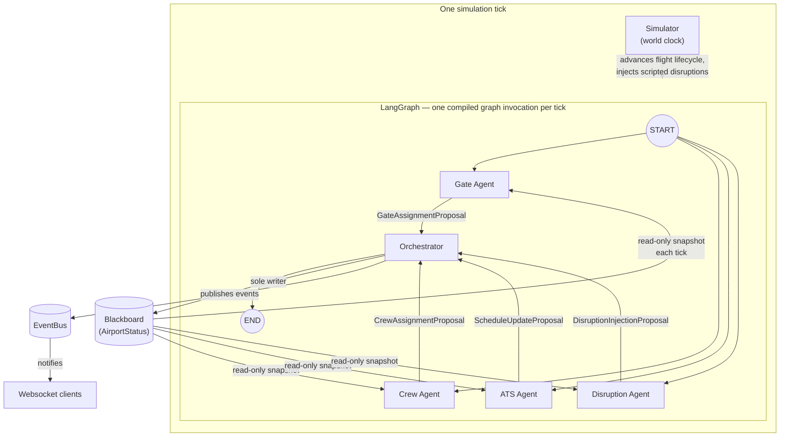

# Architecture

This document explains the *why* behind this system's design, not just the *what*. Code comments and docstrings cover implementation detail; this is the design rationale — the kind of thing worth being able to explain in an interview.

## The core problem this architecture solves

Five agents (Gate, Crew, ATS, Disruption, Orchestrator) need to coordinate around shared resources — gates, crew, schedules — while:
1. Never corrupting shared state under concurrent execution
2. Letting the decision-making logic evolve from simple rules to LLM-based reasoning without touching orchestration code
3. Staying realistic enough that a mock data feed and a real one are interchangeable

Every major decision below traces back to one of those three goals.

## System overview

Four agents run **concurrently** each tick, see the same **read-only snapshot** of state, and can never write to it. The Orchestrator is the only agent with write access, and only ever sees ids in the proposals it receives — never live object references — so it always looks up the current, authoritative object on the live board before mutating anything.

## Why `agents/` and `decisions/` are separate top-level folders

This is the single most important structural decision in the codebase.

- **`agents/`** — the LangGraph node for each agent. Handles state/message passing, reads the snapshot, calls into `decisions/`, packages the result as a typed proposal. This code **never changes** regardless of how sophisticated the decision-making gets.
- **`decisions/`** — the actual decision function for each agent (`decide_gate_assignment`, `decide_crew_assignment`, etc.). This is the *only* thing that changes when swapping rule-based logic for a model-based version. Same function signature in, same signature out — nothing else in the codebase needs to know or care.

Keeping these as separate top-level folders (not nested inside one `agents/` tree) means a git diff of "swap gate assignment from rules to ML" touches exactly one file. That's a deliberate, visible signal of the architecture's pluggability — useful in a codebase, more useful in an interview.

### Rule-based vs. LLM-based: how the split was decided

Not every decision benefits from an LLM call. The dividing line used here: **does this decision require genuine multi-factor judgment, or is it a deterministic lookup/filter?**

| Decision | Type | Why |
|---|---|---|
| Gate assignment | Rule-based | Constraint satisfaction — aircraft size vs. gate capability. No judgment call, an LLM call would only add latency and cost for the same answer. |
| Crew assignment | Rule-based | Filter by role/availability/shift time, pick most-remaining-shift for load balancing. Same reasoning. |
| Delay-risk flagging | Rule-based | Already computable from timestamps; a secondary heuristic (wide-body still not gated) needs no reasoning. |
| Disruption priority | LLM-based | "How urgently should this be escalated" is a genuine judgment call that also needs to produce natural-language reasoning for the live decision log — an LLM does both in one call. |
| Conflict resolution | LLM-based | Choosing which of several competing proposals should win a resource conflict is exactly the kind of multi-factor tradeoff an LLM is suited for, and again needs to explain itself. |

The two LLM-based functions are also the two places this system is provider-agnostic by construction: both are written against LangChain's generic chat-model interface (`.with_structured_output()`, `.ainvoke()`), so switching from Anthropic to Google Gemini required changing exactly one import and one constructor call per file — nothing else moved.

## Single-writer pattern: correctness by construction, not by discipline

Early on, the question was: how do four concurrently-running agents mutate shared state safely? The answer that was chosen deliberately avoids "just be careful" as a strategy:

- The four non-Orchestrator agents receive a **detached, read-only snapshot** (`AirportStatus.model_validate(board.model_dump())`), taken fresh at the start of every tick. They are typed to receive `AirportStatus`, not `Blackboard` — so they have no type-level access to the lock or the write methods at all. They structurally *cannot* mutate shared state; it's not a convention they're trusting themselves to follow.
- They return **proposals** (`GateAssignmentProposal`, `CrewAssignmentProposal`, `ScheduleUpdateProposal`, `DisruptionInjectionProposal`) — typed, ephemeral, per-tick messages carrying only *ids*, never live object references.
- The **Orchestrator** is the only agent that ever touches the live `Blackboard`. It collects every proposal, detects conflicts (two proposals wanting the same gate; two proposals wanting the same crew member), resolves them, and is the sole writer.

This buys three things: no distributed locking scattered across five files, no race conditions to reason about beyond one class of writer, and "the Orchestrator resolves conflicts raised by other agents" becomes literally true — the conflicts only exist because the Orchestrator synthesized them from independent, non-coordinating proposals, not because agents fought over a shared object.

It also scales conceptually: if these agents were ever split across processes, the snapshot-based read isolation already anticipates that a live reference wouldn't be available anyway.

## Blackboard + EventBus: two layers, not one

State coordination initially considered these as alternatives — pick one. They were kept as **complementary layers** instead:

- **Blackboard (`AirportStatus`)** — the single source of truth for actual state: gates, flights, crew, disruptions, conflicts, the decision log.
- **EventBus** — a decoupled pub/sub notification layer. Agents and the frontend learn *that* something happened (a flight landed, a disruption triggered) without holding a direct reference to whoever else cares.

Dropping one for simplicity was considered and rejected: the two solve different problems (state-of-truth vs. notification-of-change), and keeping both is the more defensible pattern once "quality over deadline" became the explicit priority for this project.

Because the Blackboard can be mutated by concurrent async agent code, it exposes an `asyncio.Lock` (as a private, non-Pydantic attribute) — every mutation, including log entries, is lock-protected and always acquired sequentially, never nested, to avoid deadlocking Python's non-reentrant lock.

## The simulator owns the world clock, not decision-making

`Simulator` progresses simulated time and its direct physical consequences — flight status transitions, scripted disruptions firing at their trigger time — but never decides *what to do about* any of it. That's the agent graph's job, invoked once per tick via a single injected callback (`on_tick`).

This split matters for testability: `Simulator` has **zero import of any agent code**. It's fully written, runnable, and unit-tested in complete isolation from the agent graph — you can run the world clock with `on_tick=None` and verify flight lifecycle transitions without a single LLM call or LangGraph node existing yet.

## Real-world-data readiness

A stated non-negotiable for this project: the simulation must be swappable for a real data feed later **without structural changes**. Concretely:

- All datetime fields are normalized to timezone-aware UTC via a shared validator, because real flight/ops data is virtually always timezone-aware, and mixing naive mock timestamps with aware real ones is a guaranteed `TypeError` waiting to happen.
- Mock data generators (`generate_mock_flights`, `generate_mock_disruptions`, etc.) take the same inputs and return the same `list[Flight]` / `list[DisruptionEvent]` contract that a real data loader would need to satisfy — swapping mock for real is a drop-in replacement, not a rewrite.
- Turnaround times are randomized ranges, not fixed constants, to resemble real operational variability rather than a toy simulation.

## Known limitations / open design questions

- Flight cancellation doesn't yet clear an already-assigned gate or crew — this is agent/orchestrator logic to add, deliberately not schema-level (see the pure-data-holder principle for `core/models.py`).
- The Disruption Agent currently only re-escalates disruptions the simulator already scripted; it doesn't yet predict or propose genuinely new ones. That's the more interesting version of this agent, not yet built.
- No generic per-tick websocket heartbeat exists — a quiet tick (none of the four push-triggering events) produces no push. Acceptable for now, worth revisiting for a production frontend.
- Single-process deployment (FastAPI + LangGraph together) hasn't been reconsidered against a split background worker now that this is no longer timeline-constrained.

## Tech stack rationale, briefly

- **LangGraph** over a hand-rolled agent loop: fan-out/fan-in concurrency, typed state, and a reducer-based proposal accumulator (`Annotated[list[AgentProposal], operator.add]`) come for free instead of hand-written.
- **Pydantic v2** throughout: schemas are pure data holders (no business logic, no side effects beyond input normalization), which keeps `core/models.py` framework-agnostic and independently unit-testable.
- **FastAPI**: async-native, matches the fully-async agent architecture end to end (agent nodes are async specifically because the pluggable decision layer eventually calls network-bound LLM APIs — building async from day one avoided retrofitting every agent node later).